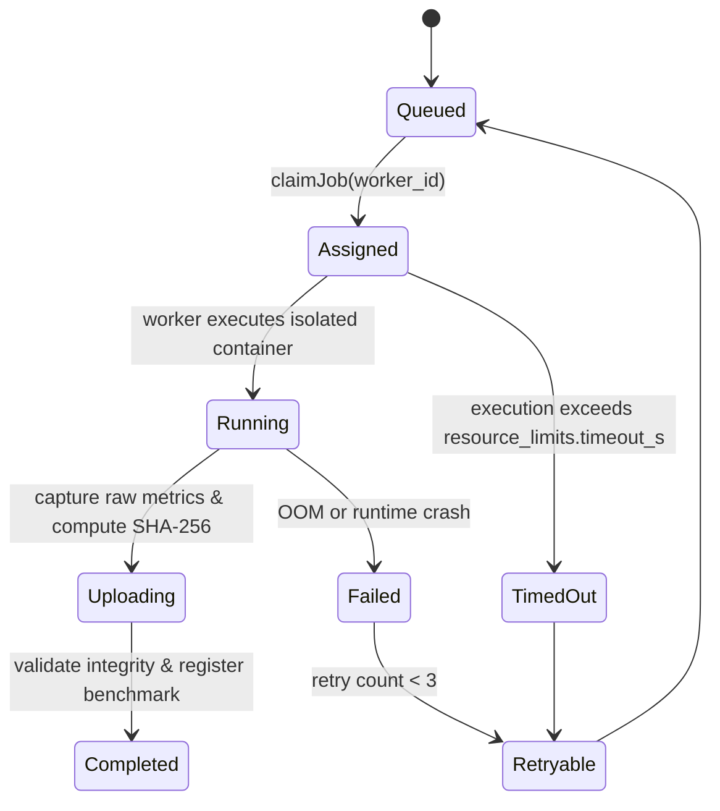

# ModelForge Distributed Benchmark Network Architecture

## 1. Overview & Trust Architecture

The ModelForge Distributed Benchmark Network enables heterogeneous hardware nodes—from community hobbyists to private enterprise data centers—to execute reproducible inference benchmarks and contribute structured performance evidence to the OpenComputeBench graph.

### Trust Tier Hierarchy

To balance open community contributions with enterprise verification standards, ModelForge categorizes workers into six distinct trust tiers:

```text
[Attested]       -> Hardware TPM / Confidential Computing (SEV-SNP / TDX)
  [Managed]      -> First-party ModelForge official runner infrastructure
    [Organization]-> Enterprise authenticated private workers (tenant isolated)
      [Trusted]    -> Multi-run reproducible community contributors (reputation >= 90)
        [Community]-> Public self-registered nodes (default sandbox execution)
          [Untrusted]  -> Unverified or anomalous reporting nodes
```

1. **Attested**: Hardware attestation verifies runtime integrity, kernel version, and uncorrupted GPU memory via TPM measurements.
2. **Managed**: Directly operated and provisioned by ModelForge in cloud regions (AWS, GCP, Azure, Lambda Labs, RunPod).
3. **Organization**: Private enterprise cluster workers. Workload profiles, benchmark results, and hardware details remain tenant-isolated under Row Level Security (RLS).
4. **Trusted**: Community workers that have successfully reproduced 10+ golden benchmarks within 3% tolerance.
5. **Community**: Open public nodes running the open-source `modelforge worker` daemon. Results are tagged as `community` verification status until independently reproduced.
6. **Untrusted**: Nodes exhibiting performance variance > 15% or non-reproducible environment hashes.

---

## 2. Job Queue State Machine & Protocol

Benchmark tasks are distributed as declarative, immutable `BenchmarkJob` specifications.



### Protocol Lifecycle

1. **Enqueue**: Active learning scheduler or enterprise admin places a job in `queued` status with a `priority_score` (0–150).
2. **Claim**: A worker sends an authenticated HTTP POST to `/api/v1/jobs/claim` specifying its hardware device and trust tier. The queue matches the highest-priority eligible job.
3. **Execution**: The worker launches the benchmark inside an isolated container with resource limits (`timeout_s`, `max_gpus`).
4. **Digest Calculation**: The worker computes the `environment_hash` and `result_hash`.
5. **Completion**: The worker uploads the OpenComputeBench record to `/api/v1/jobs/[id]/complete`.
