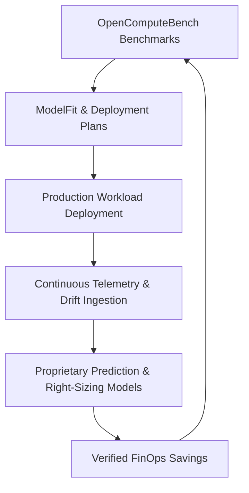

# ModelForge Moat Scorecard & Defensibility Strategy

## Strategic Objective: Turn Real Usage into Proprietary Deployment Intelligence

ModelForge sits at the critical juncture between Hugging Face model artifacts and production AI compute. This document codifies the 7-layer defensibility architecture and compounding flywheels that transition ModelForge from open infrastructure into a defensible platform.

---

## 1. The Compounding Flywheel

1. **Evidence Ingestion**: Community and private enterprise workers continuously benchmark new models, hardware devices, runtimes, and precision configurations into OpenComputeBench.
2. **Workload Sizing**: Developers compile workload SLOs into optimal deployment plans backed by measured evidence.
3. **Continuous Production Ingestion**: Live production clusters ingest performance telemetry (P95 TTFT, TPOT, concurrency, GPU utilization) under strict Zero Prompt Logging.
4. **Predictive Calibration**: Observed variance between expected and observed performance trains ModelForge's Level 0 Analytical and Level 1 Nearest-Neighbor prediction models.
5. **Verified FinOps Value**: Right-sizing recommendations generate quantifiable cost reductions that cannot be contested because they are verified by live after-state telemetry.

---

## 2. The 7-Layer Defensibility Moat

| Layer       | Moat Component                            | Defensibility Mechanism                                                                                                                                    | Replication Difficulty                                             |
| :---------- | :---------------------------------------- | :--------------------------------------------------------------------------------------------------------------------------------------------------------- | :----------------------------------------------------------------- |
| **Layer 1** | **Deployment Intelligence Graph**         | Multi-dimensional graph connecting models, revisions, hardware, precisions, and serving runtimes with empirical performance hashes.                        | High (Requires exhaustive compute matrix across diverse hardware). |
| **Layer 2** | **Distributed Worker Network**            | Community and private enterprise workers contributing heterogeneous compute (NVIDIA, AMD, Apple, Intel).                                                   | High (Network effects and trust tiers).                            |
| **Layer 3** | **Workload-to-Topology Mapping**          | Proprietary algorithms translating workload fingerprints into optimal tensor parallel, pipeline parallel, and disaggregated prefill/decode configurations. | High (Combines memory profiling with empirical scaling).           |
| **Layer 4** | **Historical Performance Corpus**         | Multi-generational runtime and driver performance regression tracking across CUDA, ROCm, TensorRT-LLM, vLLM, and Dynamo.                                   | Very High (Cannot be backfilled retrospectively).                  |
| **Layer 5** | **Predictive Inference Models**           | Hybrid Level 0 Analytical Roofline + Level 1 Nearest-Neighbor interpolation predicting unmeasured configurations with rigorous uncertainty intervals.      | High (Requires large verified training anchor set).                |
| **Layer 6** | **Continuous Production Ops**             | Real-time drift detection comparing live telemetry against expected baselines with human-in-the-loop recommendation approvals.                             | High (Deep enterprise cluster integration).                        |
| **Layer 7** | **Private Enterprise Fleet Intelligence** | Tenant-isolated hardware catalogs, reservation bin-packing, What-If capacity planning, and verified FinOps ledgers.                                        | Very High (Enterprise data gravity and high switching costs).      |

---

## 3. Competitive Boundaries & Non-Goals

ModelForge is strategically positioned as **the decision and optimization intelligence layer**. To maintain extreme focus, ModelForge explicitly avoids commodity adjacencies:

1. **Not a Cloud Provider or GPU Marketplace**: ModelForge does not sell raw compute or broker spot instances. ModelForge helps enterprises optimize whichever clouds or on-prem clusters they already own.
2. **Not a Generic Model Registry**: Hugging Face owns the model ecosystem; ModelForge integrates natively with Hugging Face model IDs, revisions, and Hub APIs.
3. **Not a Generic Observability Suite**: Datadog and Prometheus capture generic CPU/RAM/network metrics. ModelForge captures _model-aware inference telemetry_ (TTFT, TPOT, KV memory saturation, decode concurrency).
4. **Not an LLM Gateway**: ModelForge does not route API requests at runtime or log prompts. ModelForge designs, optimizes, and compiles the serving infrastructure underneath.

---

## 4. Switching Costs & Data Gravity

Once an enterprise adopts ModelForge:

- **Verified Savings Records**: Provide finance and procurement teams with documented ROI on GPU expenditure.
- **Continuous Drift Baselines**: Alert infrastructure teams immediately when model fine-tunes or traffic surges violate established SLOs.
- **GitOps Manifest Integration**: Deployment plans compile directly into Helm charts, KServe specs, and NVIDIA Dynamo configurations, creating structural workflow stickiness.
