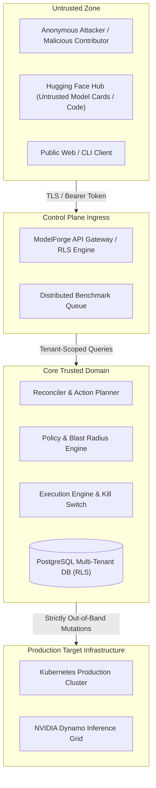

# MODELForge Complete Threat Model & STRIDE Review

## 1. Executive Summary & Scope

ModelForge operates as an autonomous inference deployment intelligence and closed-loop execution plane between Hugging Face open models and production AI compute infrastructure (Kubernetes, NVIDIA NIM, NVIDIA Dynamo, vLLM, TensorRT-LLM). Because ModelForge commands mutation authority over live infrastructure and holds deployment telemetry, this document establishes a rigorous STRIDE threat analysis across all system boundaries.

---

## 2. Core Assets & Classification

| Asset ID | Asset Name | Confidentiality | Integrity | Availability | Description |
| :--- | :--- | :--- | :--- | :--- | :--- |
| **AST-01** | Production Deployment State | High | Critical | Critical | Live container topology, replica counts, traffic weights |
| **AST-02** | Provider Credentials | Critical | Critical | High | Kubeconfigs, cloud API tokens, NVIDIA registry keys |
| **AST-03** | Optimization Action Contracts | Medium | Critical | High | Cryptographically bound SHA-256 action specifications |
| **AST-04** | Telemetry & Observability Streams | High | High | High | TTFT, TPOT, token throughput, error rates (zero prompt data) |
| **AST-05** | Benchmark Provenance Records | Public | Critical | High | Empirical benchmark measurements with signed SHA-256 hashes |
| **AST-06** | Performance Prediction Weights | Medium | Critical | High | Neural uncertainty models for latency and cost forecasting |
| **AST-07** | Distributed Worker Tokens | High | Critical | High | Authentication credentials for community and enterprise workers |
| **AST-08** | Multi-Tenant Organization Data | Critical | Critical | Critical | Tenant isolation boundaries, API keys, billing subscriptions |
| **AST-09** | Automation Policies | High | Critical | Critical | Organizational guardrails, allowed changes, blast radius caps |
| **AST-10** | Emergency Freezes / Kill Switch | Medium | Critical | Critical | Global and deployment mutation freeze state records |
| **AST-11** | Verified Production Outcomes | Medium | Critical | High | Post-deployment telemetry feeding model learning loops |

---

## 3. Trust Boundaries & Attack Surfaces

### Trust Boundary Definitions

1. **TB-01 (Client to API Gateway)**: Public HTTPS boundary requiring session cookies or scoped API bearer keys.
2. **TB-02 (Worker to Job Queue)**: Token-authenticated boundary with strict trust tiering (`community` vs `enterprise_private`).
3. **TB-03 (Tenant to Tenant)**: Strict PostgreSQL Row Level Security (RLS) partition using `is_org_member(organization_id)`.
4. **TB-04 (Control Plane to Infrastructure)**: Strictly out-of-band management channel using scoped service accounts with zero prompt logging.
5. **TB-05 (HF Model Ingestion)**: Metadata-only analysis; `trust_remote_code=True` is disabled by default to eliminate remote code execution.

---

## 4. Threat Actor Profiles

1. **Compromised Benchmark Worker**: A node submitting inflated or poisoned benchmark metrics to corrupt optimization rankings.
2. **Malicious Tenant Member**: An authenticated user attempting cross-tenant reads or escalating privileges from developer to approver.
3. **Infrastructure Man-in-the-Middle**: An attacker attempting to intercept or alter container images, specs, or traffic routing splits.
4. **Adversarial Model Card Author**: A creator uploading malicious payloads, format exploits, or prompt injection payloads in model repo cards.

---

## 5. STRIDE Threat Analysis & Mitigations

### 5.1 Spoofing (Identity & Credentials)

- **Threat**: Attacker spoofs worker ID or submits results on behalf of another node.
- **Mitigation**: Workers authenticate via cryptographically random HMAC-SHA256 registration tokens. Job completions are rejected if the claiming worker identity differs from the reporting worker.

### 5.2 Tampering (Data & Infrastructure Mutation)

- **Threat**: Attacker alters target deployment spec after an administrator approves the action.
- **Mitigation**: `Reconciler.computeActionHash` computes an immutable SHA-256 hash over `{ deployment_id, action_type, current_spec, target_spec }`. The `ExecutionEngine.verifyApprovalIntegrity` recomputes and verifies this hash prior to executing each step. Any change aborts the execution with an `INTEGRITY_VIOLATION`.

### 5.3 Repudiation (Audit Trail & Logging)

- **Threat**: Operator denies executing an emergency rollback or approving a risky canary.
- **Mitigation**: Every state transition emits an immutable `ControlAuditLog` record capturing `user_id`, `role`, `action_hash`, `event_type`, and timestamp.

### 5.4 Information Disclosure (Privacy & Cross-Tenant Leaks)

- **Threat**: Tenant A accesses Tenant B's deployments, telemetry, or private benchmarks.
- **Mitigation**: PostgreSQL RLS is enabled on all tables (`public.inference_deployments`, `public.optimization_actions`, `public.canary_runs`, etc.) with default deny and `is_org_member(organization_id)` predicates.

### 5.5 Denial of Service (Exhaustion & Lockouts)

- **Threat**: Rapid submission of optimization actions exhausts compute or locks out live serving.
- **Mitigation**: Per-tenant deployment locks (`ExecutionEngine.acquireLock`), blast radius concurrency caps (`max_simultaneous_actions: 3`), and rate-limited API endpoints.

### 5.6 Elevation of Privilege (Unauthorized Mutation Authority)

- **Threat**: Developer-role user bypasses policy checks or forces autonomous execution without approval.
- **Mitigation**: PolicyEngine evaluates changes against the organizational `AutomationPolicy`. High-risk operations (`change_runtime`, `change_gpu_count`, `change_model_revision`) strictly mandate `approval_required` and dual-signature validation.
